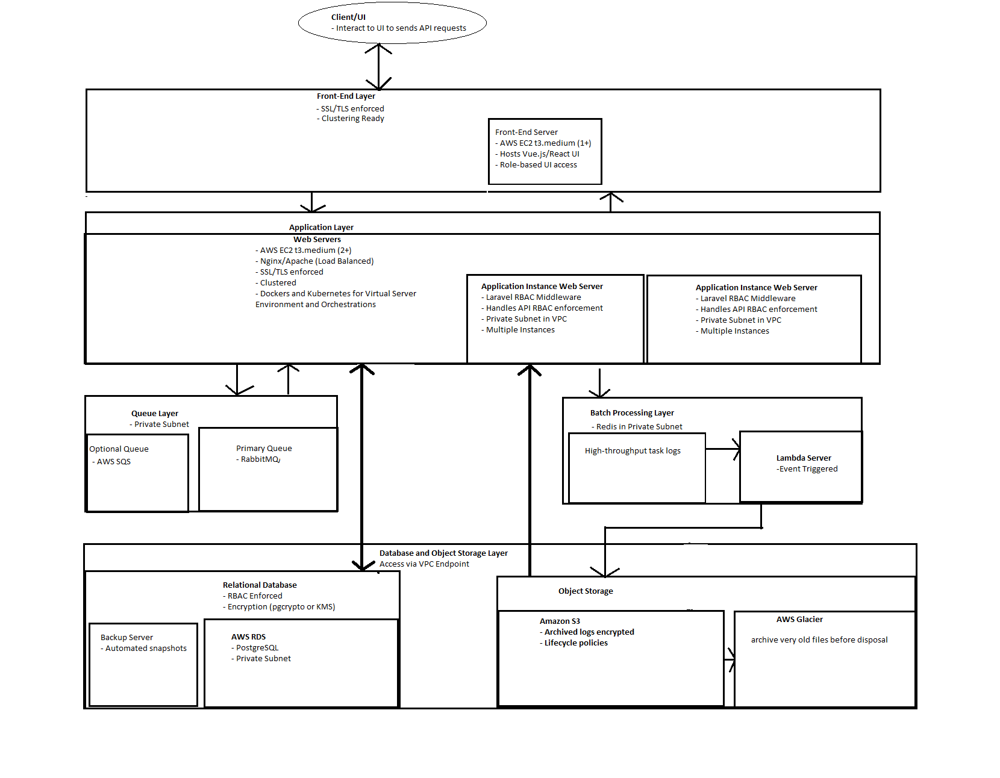

<video controls>
  <source src="./audit_module/video1318901265.mp4" type="video/mp4">
  Your browser does not support the video tag.
</video>
---

# Video and Audio Presentation - Your browser does not support the video tag.


place these 3 files on the same directory and play the vidoe file

---
# Sample Diagram for the Audit Module



--- 
# System Architecture for Laravel Application on AWS

---
## Relational Database Server
- **AWS RDS (db.m5.large)**: Use PostgreSQL for its full ACID compliance and high data integrity, suitable for audit trails.
  - **Backup and Recovery**: Enable automated snapshots and point-in-time recovery to ensure data reliability.

## Application Servers
- **Instances**: Start with at least 2 AWS EC2 `t3.medium` instances to handle application workloads. Scale up as needed based on application demand.
  - Use a web server or framework setup, such as **Nginx** or **Apache**, optimized for Laravel.

## Queue Server
- **AWS cache.t3.medium**: For queue implementation, consider:
  - **RabbitMQ**: For advanced message routing.
  - **Redis**: For simpler queueing needs with high throughput.
  - Alternatively, use **AWS SQS** as a fully managed queueing service.
  - **Optional**: Use dedicated in-memory databases like Redis or Memcached for batch processing if required.

## Storage
- **Amazon S3**: Use for log archives to enable cost-effective storage.
  - **Optional**:
    - Use **Amazon Athena** for querying archived logs. Define an appropriate schema for structured or semi-structured data (e.g., JSON).
    - Implement **AWS Lambda** to trigger batch archiving of logs based on time or data thresholds.

---

## Security

### Database
- **Access Control**: Implement Role-Based Access Control (RBAC) or least-privilege principles based on user roles.
- **Encryption**:
  - Use encryption at rest. For PostgreSQL, utilize the `pgcrypto` extension to encrypt sensitive data columns.
  - **Note**: Encrypting individual columns can impact query performance. Consider **AWS KMS** for full database encryption if performance is critical.
- **Archived Data**:
  - Retain encryption for archived logs but add fields for keyword-based searches. This allows querying with **Amazon Athena** and performing decryption only after retrieving relevant records.

### Application Servers
- **SSL**: Enforce SSL/TLS for all communications.
- **Firewall Rules**: Close unnecessary ports and define explicit rules.
- **VPC**: Place application servers in a private subnet within a VPC.
- **Load Balancer**: Configure security rules, such as IP whitelisting or blocking.
  - **Optional**: Use a NAT Gateway to enable controlled outbound internet access for servers in private subnets.

### Other Services
- **Queue Server and S3**:
  - Use private subnets for services where applicable.
  - For S3, configure **VPC endpoints** to enable private access without exposing traffic to the internet.

---

## Performance

### Database
- **Archiving**:
  - Implement data archiving to S3 to reduce database costs and maintain optimal performance.
  - Use lifecycle policies for archived data, such as automatic tiering to Glacier for long-term cost optimization.

### Application Servers
- **Containerization**:
  - Use **Docker** and **Kubernetes** for containerization and orchestration to enhance scalability and reliability.
  - Specify whether this setup is intended for microservices or hosting monolithic Laravel applications.

### Application Architecture
- **Microservices**:
  - Design the application using REST-based microservices for better modularity and scalability.
- **Laravel Libraries and Extensions**:
  - Leverage third-party libraries to optimize performance and security:
    - **L5 Swagger**: For API endpoint documentation.
    - **Laravel Sentry**: For internal error monitoring.
    - **Spatie Laravel**: For role-based access control of API endpoints.
    - **Laravel Throttle**: To limit API usage and prevent abuse.
    - **Horizon**: For managing Laravel queue workers.
    - **Laravel Passport**: For token-based access control using OAuth2 authentication.
    - **AWS SDK for PHP**: For seamless interaction with AWS services.
  - **Optional**:
    - **Laravel Scheduler**: For automating batch operations, such as archiving logs to S3 or generating periodic reports.

---
# Database Structure

## Tables and Fields

### audit_logs
- **id** (Primary Key, BIGINT, AUTO_INCREMENT): Unique identifier for the log.
- **event_type_id** (INT, Foreign Key): Reference to the event type in `audit_event_types`.
- **user_id** (BIGINT, Foreign Key): Reference to the user who triggered the event.
- **object_type** (VARCHAR(100)): The type of entity affected (e.g., Invoice, User).
- **object_id** (BIGINT): Identifier of the affected entity.
- **timestamp** (TIMESTAMP): When the event occurred.
- **domain_source** (VARCHAR(100)): Source domain of the log.
- **ip_address** (VARCHAR(45)): IP address of the user who triggered the event.
- **description** (TEXT): Detailed description of the event.
- **metadata** (JSONB): Additional data about the event (flexible schema for event-specific details).
- **created_at** (TIMESTAMP, DEFAULT CURRENT_TIMESTAMP): When the log was created.
- **updated_at** (TIMESTAMP, DEFAULT CURRENT_TIMESTAMP ON UPDATE CURRENT_TIMESTAMP): Last time the data was updated.
- **Indexes**:
  - Index on `event_type_id` for quick filtering by event types.
  - Index on `user_id` for tracking actions by a specific user.
  - Composite index on `(object_type, object_id)` for entity-specific filtering.

---

### audit_event_types
- **id** (Primary Key, INT): Unique identifier for the event type.
- **event_name** (VARCHAR(100)): Name of the event type (e.g., CREATE, UPDATE, DELETE).
- **description** (TEXT): Detailed description of the event.
- **created_at** (TIMESTAMP, DEFAULT CURRENT_TIMESTAMP): When the event type was created.
- **updated_at** (TIMESTAMP, DEFAULT CURRENT_TIMESTAMP ON UPDATE CURRENT_TIMESTAMP): Last time the event type was updated.

---

### users
- **id** (Primary Key, BIGINT): Unique identifier.
- **username** (VARCHAR(100)): User's login name.
- **email** (VARCHAR(255)): Email address.
- **password** (VARCHAR(255)): Securely hashed password.
- **role** (VARCHAR(50)): Role of the user (e.g., Admin, Editor, Viewer).
- **created_at** (TIMESTAMP, DEFAULT CURRENT_TIMESTAMP): When the user was created.
- **updated_at** (TIMESTAMP, DEFAULT CURRENT_TIMESTAMP ON UPDATE CURRENT_TIMESTAMP): Last time the user’s data was updated.

---
## Crucial Code Snippets

### AuditTrailController
```php
use Illuminate\Http\Request;
use Illuminate\Support\Facades\Queue;

class AuditTrailController extends Controller
{
    public function log(Request $request)
    {
        // Validate the incoming request data
        $validatedData = $request->validate([
            'type' => 'required|string|in:user_action,system_event,custom_event',
            'details' => 'required|array', // Expecting JSON data in 'details'
        ]);

        // Dispatch the data into the appropriate queue
        switch ($validatedData['type']) {
            case 'user_action':
                Queue::push(new \App\Jobs\LogUserAction($validatedData['details']));
                break;

            case 'system_event':
                Queue::push(new \App\Jobs\LogSystemEvent($validatedData['details']));
                break;

            case 'custom_event':
                Queue::push(new \App\Jobs\LogCustomEvent($validatedData['details']));
                break;

            default:
                return response()->json(['error' => 'Invalid event type'], 400);
        }

        // Respond with HTTP 202 Accepted status.
        // Critical code so that api call to audit logger will be non blocking type
        return response()->noContent(202);
    }
}
```

### Route
```php
Route::post('/audit-trail/log', [AuditTrailController::class, 'log']);
```

### Job Class for Logging User Actions
```php
namespace App\Jobs;

use Illuminate\Bus\Queueable;
use Illuminate\Contracts\Queue\ShouldQueue;
use Illuminate\Foundation\Bus\Dispatchable;
use Illuminate\Queue\InteractsWithQueue;
use Illuminate\Queue\SerializesModels;

class LogUserAction implements ShouldQueue
{
    use Dispatchable, InteractsWithQueue, Queueable, SerializesModels;

    protected $details;

    /**
     * Create a new job instance.
     *
     * @param array $details
     */
    public function __construct(array $details)
    {
        $this->details = $details;
    }

    /**
     * Execute the job.
     */
    public function handle()
    {
        // Validate required keys in the details array
        if (!isset($this->details['user_id'], $this->details['object_type'], $this->details['object_id'], $this->details['description'])) {
            throw new \Exception('Missing required details for logging user action.');
        }

        // Log user action into the database
        \DB::table('audit_logs')->insert([
            'event_type' => 'user_action',
            'user_id' => $this->details['user_id'],
            'object_type' => $this->details['object_type'],
            'object_id' => $this->details['object_id'],
            'description' => $this->details['description'],
            'metadata' => json_encode($this->details['metadata'] ?? []), // Optional metadata
            'timestamp' => now(),
        ]);
    }
}
```

### Client API Call to Store Audit Trail Logs
```php
$response = $client->post($url, [
    'headers' => [
        'Prefer' => 'respond-async', // Standard header for async requests. Making request a non blocking process
        'Content-Type' => 'application/json',
    ],
    'json' => [
        'type' => $type, // E.g., 'user_action'
        'details' => $details, // E.g., JSON data with event specifics
    ],
    'http_errors' => false, // Prevent exceptions on HTTP errors
]);

if ($response->getStatusCode() !== 202) {
    // Handle error response
    throw new \Exception('Failed to log audit trail: ' . $response->getBody());
}
```
This acts as a guide and needs to be adjusted if caller is front end.


---

## Tools and Integration

### Spec Tests
- Use **PHPUnit** for Laravel components.
- Mock queues with `Laravel’s Queue::fake()`.

### E2E Tests
- Use **Cypress** or **Playwright** for API and UI tests.
- Mock database and S3 queries using custom tasks or stubs.

### CI/CD Integration

---

## Basic Test Coverage

### Validation Tests
- Ensure the `/audit-trail/log` endpoint validates inputs correctly.
- Test for missing or invalid fields.

### Job Dispatch Tests
- Verify that the correct job is dispatched for each type.

### Job Execution Tests
- Test individual jobs (e.g., `LogUserAction`) for proper database insertion.

### Database Tests
- Validate the database schema and ensure data is inserted correctly.

---

## Implementation

### Validation Tests
```php
public function test_audit_log_endpoint_validation()
{
    $response = $this->postJson('/audit-trail/log', [
        'type' => 'invalid_type',
        'details' => [],
    ]);

    $response->assertStatus(422); // Validation error
    $response->assertJsonValidationErrors(['type', 'details']);
}
```

### Job Dispatch Tests
```php
public function test_audit_log_dispatches_correct_job()
{
    Queue::fake();

    $this->postJson('/audit-trail/log', [
        'type' => 'user_action',
        'details' => [
            'user_id' => 1,
            'object_type' => 'Invoice',
            'object_id' => 123,
            'description' => 'Created an invoice',
        ],
    ]);

    Queue::assertPushed(\App\Jobs\LogUserAction::class);
}
```

### Job Execution Tests
```php
public function test_log_user_action_job_inserts_data()
{
    $details = [
        'user_id' => 1,
        'object_type' => 'Invoice',
        'object_id' => 123,
        'description' => 'Created an invoice',
    ];

    $job = new \App\Jobs\LogUserAction($details);
    $job->handle();

    $this->assertDatabaseHas('audit_logs', [
        'event_type' => 'user_action',
        'user_id' => 1,
        'object_type' => 'Invoice',
        'object_id' => 123,
    ]);
}
```

---

## End-to-End (E2E) Tests for Audit System

### Test Scenarios

#### Log a User Action
- API call to `/audit-trail/log`.
- Verify the log is stored in the `audit_logs` table.

#### View Logs (Optional)
- Query logs using a UI or API endpoint (if available).
- Apply filters and verify results.

#### Archive Logs
- Simulate archiving old logs to S3 and ensure they are no longer in the database but accessible in S3.

---

### Implementation (Example using Cypress)

#### Log a User Action
```javascript
describe('Audit Log API', () => {
    it('logs a user action and verifies database entry', () => {
        cy.request('POST', '/audit-trail/log', {
            type: 'user_action',
            details: {
                user_id: 1,
                object_type: 'Invoice',
                object_id: 123,
                description: 'Created an invoice',
                metadata: { key: 'value' }
            },
        }).then((response) => {
            expect(response.status).to.eq(202);

            // Verify database entry (use a custom command or stubbed DB query)
            cy.task('queryDatabase', 'SELECT * FROM audit_logs WHERE object_id = 123')
              .then((result) => {
                  expect(result).to.have.length(1);
                  expect(result[0].event_type).to.eq('user_action');
              });
        });
    });
});
```

#### View Logs (UI Testing)
```javascript
describe('View Audit Logs', () => {
    it('filters logs by user and verifies results', () => {
        cy.visit('/audit-logs');

        // Apply filter
        cy.get('[data-test="filter-user-id"]').type('1');
        cy.get('[data-test="apply-filter"]').click();

        // Verify displayed logs
        cy.get('[data-test="log-entry"]').should('have.length.at.least', 1);
        cy.get('[data-test="log-entry"]').first().should('contain.text', 'Created an invoice');
    });
});
```

#### Archive Logs
```javascript
describe('Archive Logs', () => {
    it('archives logs older than 1 year and verifies S3 storage', () => {
        cy.task('triggerLambda', { functionName: 'archiveLogs' })
          .then(() => {
              cy.task('queryDatabase', 'SELECT * FROM audit_logs WHERE timestamp < NOW() - INTERVAL 1 YEAR')
                .then((result) => {
                    expect(result).to.have.length(0); // No old logs in DB

                    // Verify log presence in S3 (using a mocked S3 API)
                    cy.task('checkS3Object', { bucket: 'audit-logs', key: 'archive/2022.json' })
                      .then((exists) => {
                          expect(exists).to.be.true;
                      });
                });
          });
    });
});
```

---

## Example: Integrate Automated Testing with Terraform

### 1. Use Terraform to Deploy Testing Infrastructure
- Terraform can provision the infrastructure required for your testing environment. For example:
  - Deploy application servers, queue servers (Redis/RabbitMQ), and databases.
  - Configure S3 buckets for storage.
  - Set up testing environments, such as a staging environment for end-to-end (E2E) tests.

### 2. Integrate Terraform with Testing Frameworks
- After deploying infrastructure with Terraform, integrate testing tools (like Cypress, PHPUnit, or Playwright) to validate the audit system.

### 3. Trigger Testing Post Deployment
- Use a CI/CD pipeline (e.g., GitHub Actions, GitLab CI, Jenkins) to run automated tests after Terraform applies the infrastructure.

### 4. Incorporate Terraform Modules for Test-Specific Resources
- You can create Terraform modules dedicated to provisioning resources for testing purposes.

### 5. Use Terraform Outputs to Feed Testing Frameworks
- Terraform outputs can provide dynamic information (e.g., API endpoints, database connection strings) to your testing framework.
- Pass Outputs to Tests: In a CI/CD pipeline, pass these outputs as environment variables to the test framework.

### 6. Validate Infrastructure and Application Together
- Combine infrastructure tests (e.g., Terraform's `terraform plan` checks or AWS resource availability) with application-level automated tests.
- **Application Tests**: Run spec and E2E tests (e.g., PHPUnit, Cypress) after infrastructure validation.


## Total Estimated Timeline
- **6-10 Weeks** (assuming no major blockers along with the concurrent timelines of backend, frontend, and QA).

## Required Team
| Role               | Estimated Count | Responsibilities                                    | Time Estimate  |
|--------------------|-----------------|----------------------------------------------------|----------------|
| Business Analyst   | 1               | Requirement gathering and documentation.          | 1-2 Weeks      |
| Solution Architect | 1               | Designing system architecture and database schema. | 1-2 Weeks      |
| Backend Developers | 1-2             | Developing API, jobs, database logic, and encryption.| 4-6 Weeks      |
| Frontend Developer | 1 (Optional)    | Building UI for managing and viewing audit logs.  | 1-2 Weeks      |
| QA Engineer        | 1               | Testing functionality, performance, and security. | 2 Weeks        |
| DevOps Engineer    | 1               | Managing deployment, queue servers, S3, and monitoring.| 1 Week      |


# Proper Documentation Guidelines

## 1. API Documentation (Swagger)

### What to Include:
- **Endpoints** (`/audit-trail/log`, etc.) with:
  - Method types (e.g., POST, GET).
  - Request parameters (e.g., type, details).
  - Sample request payloads.
  - Response codes (e.g., 202, 400, 422).
  - Error messages with possible causes.
  - Authentication requirements (e.g., API tokens or OAuth2).
  - Rate limits, if any.

### Suggestions:
- Keep the Swagger API documentation up-to-date with every code change.
- Include example payloads for different event types (e.g., `user_action`, `system_event`).
- Provide curl examples or SDK snippets for quick testing.

## 2. Developer-Focused Documentation (README.md)

### What to Include:
- **Introduction**:
  - A brief overview of the audit module's purpose (e.g., logging events for traceability and auditing).
- **Setup Instructions**:
  - Prerequisites (e.g., Laravel version, Redis, RabbitMQ).
  - Installation steps (e.g., package installation, migrations).
- **Usage**:
  - API usage examples.
  - Example log entries in the database.
- **Configuration**:
  - Environment variables required (e.g., `QUEUE_CONNECTION`, `DB_HOST`, `S3_BUCKET`).
- **Testing**:
  - Commands to run unit tests and E2E tests.
- **Deployment**:
  - Steps to deploy the module (e.g., with Docker, Kubernetes).

### Suggestions:
- Add a troubleshooting section to address common setup or usage issues.
- Include a contribution guide if the module will be maintained collaboratively.

## 3. Architecture Documentation

### Purpose:
Provide a detailed understanding of how the system works, aimed at architects and developers.

### What to Include:
- **System Overview**:
  - A high-level diagram showing the client, application servers, queue, database, and storage interactions.
- **Component Descriptions**:
  - Describe each component (e.g., API, jobs, database schema) and its role in the module.
- **Data Flow**:
  - Visual or textual representation of how data moves through the system (e.g., from client requests to database storage).
- **Security Features**:
  - Explain SSL/TLS, RBAC, and encryption at rest.
- **Performance Optimizations**:
  - Document queue configurations, archiving policies, and scalability strategies.

### Suggestions:
- Use tools like Markdown Mermaid diagrams or Lucidchart for easy-to-read diagrams.
- Include example queries for debugging (e.g., database queries to inspect logs).

## 4. User Guide

### Purpose:
Help non-technical stakeholders or administrators understand how to interact with the module.

### What to Include:
- **Purpose of the Audit Module**:
  - Why the module exists and its benefits.
- **How to Use the API**:
  - Simple, step-by-step instructions to log events.
- **How to View Logs**:
  - Instructions for accessing logs (e.g., through a UI, database, or reports).
- **Log Format**:
  - Example structure of logs stored in the database.

### Suggestions:
- Include visuals or screenshots if the audit logs are accessible via a UI.
- Provide a glossary of terms (e.g., `user_action`, `metadata`).

## 5. Database Documentation

### Purpose:
Provide detailed information about the audit module's database schema.

### What to Include:
- **Schema Overview**:
  - Tables (`audit_logs`, `users`, etc.), columns, and relationships.
- **Field Descriptions**:
  - Explain each field’s purpose (e.g., `metadata` for flexible event details).
- **Indexes**:
  - Indexes used for performance optimization and their purpose.
- **Data Lifecycle**:
  - Policies for archiving logs and managing table growth.

### Suggestions:
- Use database diagramming tools (e.g., `dbdiagram.io`) for visual clarity.
- Include scripts for schema creation or migration.

## 6. Testing Documentation

### Purpose:
Ensure that developers can easily verify the system’s functionality.

### What to Include:
- **Unit Tests**:
  - How to run tests and what they cover (e.g., API validation, job handling).
- **End-to-End Tests**:
  - Steps to set up and execute E2E tests (e.g., using Cypress or Laravel Dusk).
- **Sample Scenarios**:
  - Examples of scenarios tested, like logging events and verifying database entries.

### Suggestions:
- Include expected results for key tests to make it easier to debug failures.
- Document how to mock external dependencies (e.g., Redis, S3).

## 7. Deployment Documentation

### Purpose:
Ensure seamless deployment to staging/production environments.

### What to Include:
- **Environment Setup**:
  - Required environment variables and configurations.
- **Deployment Steps**:
  - For Docker, Kubernetes, or traditional server setups.
- **Post-Deployment Checks**:
  - How to verify that the module is functioning correctly after deployment.

### Suggestions:
- Include health check endpoints for monitoring.
- Document rollback steps in case of failure.

## 8. Maintenance and Troubleshooting Guide

### Purpose:
Help maintain and troubleshoot the module post-deployment.

### What to Include:
- **Common Issues**:
  - Examples: Queue not processing, logs not archiving, database performance issues.
- **Monitoring Tools**:
  - How to use tools like Laravel Horizon for queue monitoring.
- **Performance Tuning**:
  - Recommendations for scaling the queue server or database.
- **Log Inspection**:
  - Example queries for troubleshooting logs in the database or S3.

### Suggestions:
- Provide contact points for further support.
- Document log retention policies and cleanup scripts.

## 9. Change Log

### Purpose:
Track changes made to the module over time.

### What to Include:
- **Version History**:
  - List of changes in each release (e.g., new features, bug fixes).
- **Breaking Changes**:
  - Highlight changes that require adjustments in consuming systems.

### Suggestions:
- Use a standard format like `Keep a Changelog`.
- Integrate versioning into the README.md or a separate `CHANGELOG.md` file.

## 10. Advanced Suggestions

### Interactive Documentation:
- Tools like Postman Collections allow users to test APIs interactively.

### Onboarding Guide:
- Include a guide for new developers to understand and contribute to the module.

### FAQ Section:
- Address common questions or misconceptions about the audit system.


